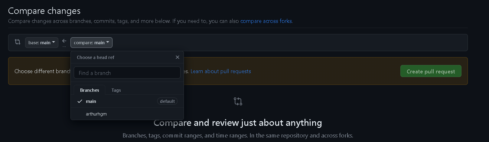
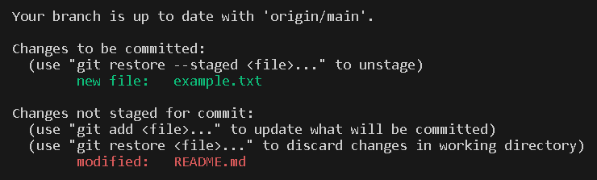
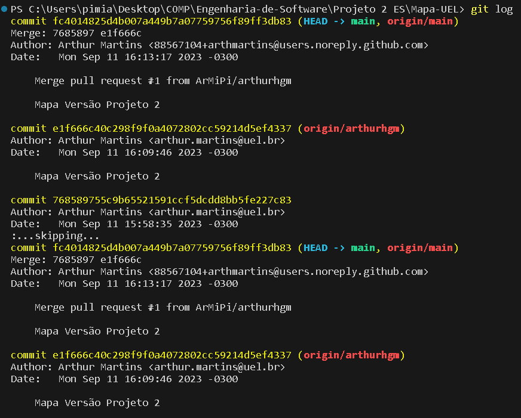
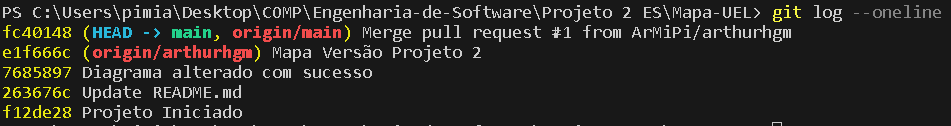

# Mapa UEL

O projeto Mapa UEL é um aplicativo que tem por objetivo auxiliar as pessoas da comunidade acadêmica da UEL a se localizarem dentro da universidade e obter informações sobre os diversos eventos relacionados à comunidade universitária. Para utilização do aplicativo será necessário um cadastro. Possuindo um cadastro, o usuário terá acesso a três telas, uma contendo um mapa da universidade indicando os centros (CCA, CCB, CCE...) e as salas desses respectivos centros, uma tela cotendo uma lista com todos os eventos atualmente cadastrados no aplicativo, dando ao usuário as opções de marcar um evento, tornando-o assim, disponível no mapa, uma opção de pesquisar por eventos e também uma opção de criar um evento e a última tela será o perfil do usuário, onde será apresentada uma foto, o email e o nome do usuário.

## REGRAS

Cada um deve criar uma branch própria e realizar suas atividades nela. Para realizar um "merge" da sua branch com a main, ou seja, fazer com que as alterações que você fez na sua branch sejam incluídas na branch principal do projeto, é necessário abrir o repositório do projeto no [github](https://github.com/ArMiPi/Mapa-UEL.git), ir na aba 'Pull requests' e clicar em 'New pull request'.

Nessa página, selecionar a sua branch e criar um pull request.

### Comandos Úteis
---

> git clone https://github.com/ArMiPi/Mapa-UEL.git

Clona o repositório do projeto na sua máquina.

> git branch -a

Lista todas as branches

> git switch `nome_da_branch`

Muda para a branch especificada

> git switch -c `nova_branch`

Cria uma branch com o nome especificado e muda a branch atual para a nova branch

> git status

Indica quais arquivos estão prontos para serem "commitados" e quais não estão

Exemplo:

> git add `nome_do_arquivo`

Adiciona um arquivo para a lista de arquivos prontos para serem "commitados". Caso queira colocar todos os arquivos nessa lista basta substituir `nome_do_arquivo` por `.`

> git commit

Comando utilizado para "commitar" os arquivos prontos. Esse comando irá abrir um editor de texto no terminal, para começar a escrever o texto do commit basta apertar a tecla `i`. Quando terminar de escrever o texto do commit, aperte a tecla `Esc` e digite `:wq`. Isso irá salvar o texto criado e irá "commitar" os arquivos

> git commit -m "mensagem do commit"

Caso o mensagem do commit possua apenas uma pequena frase, é possível utilizar esse comando

> git push -u origin `nome_da_branch`

Este comando irá "subir" os commits realizados na sua branch para o git

> git log

Apresenta informações de todos os commits realizados.

Exemplo:

> git log --oneline

Igual ao `git log`, porém apresentará apenas a primeira linha do texto do commit

Exemplo:

> git pull

Atualiza o projeto na sua máquina, "puxando" a versão do projeto que está no github
